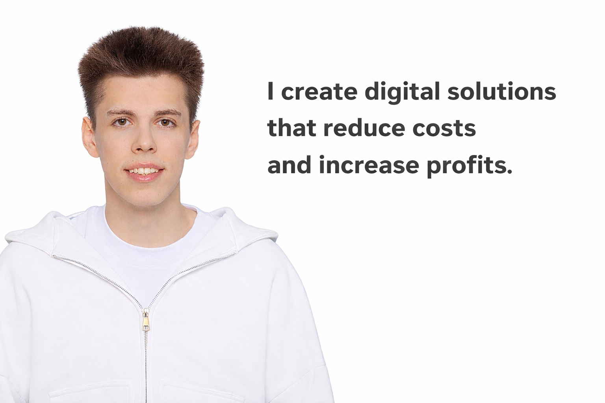

# 👋🏻 HI, I am Artem Frolov!

* 🧐 Full-stack engineer
* 💻 3+ years of development experience

  
🔧 Technology stack

  
-  Frontend
  
    - HTML (HTML5), EJS, JSX
    - CSS (CSS3), Sass (SCSS), PostCSS, Bootstrap, Tailwind, Animations
    - JavaScript (ES6+, OOP), TypeScript
    - React
    - Redux (Redux Toolkit, Redux Persist), Zustand
    - Formik, React Hook Form, Yup, Axios, React Router, React Query
    - Vite
    - ESLint, Stylelint, Prettier
    - Jest, React Testing Library, Enzyme, Chai, Mocha, Vitest
    - BEM, Feature-Sliced Design, Accessibility, UX

- Backend

  - Node.js
  - Express.js, NestJS
  - REST API, WebSockets
  - Json
  - Prisma
  - JWT, Cookies

- Database
  
  - PostgreSQL
  - Redis

- Other

  - Git (GitHub, BitBucket, GitLab)
  - Figma, Adobe Photoshop
  - Webstorm
  
  
  
### 💬 My social networks
- <a  href="https://linktr.ee/artemfroloveng">
  My social network
  </a>